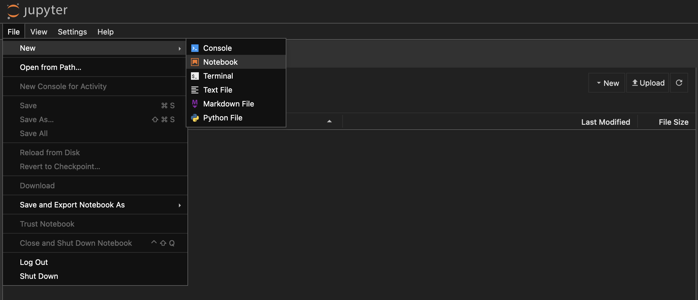

---
hide:
#  - navigation
  - toc
---

# Jupyter Notebook

It is convenient to use a Jupyter Notebook for conducting quantitative research with the Systematic Trading Toolkit.
To do that, you need to have installed the `notebook` package in your virtual environment.

---

:simple-ticktick: **Step 1**: Install `notebook` package.

=== ":material-language-python: pip"

    ```bash
    pip install notebook
    ```

=== ":simple-poetry: poetry"

    ```bash
    poetry add notebook
    ```

---

:simple-ticktick: **Step 2**: Create a new folder for saving your Jupyter Notebook(s):
```bash
mkdir notebooks
```

---

:simple-ticktick: **Step 3**: Then switch your current working directory to the `notebooks/` directory and start the Jupyter Notebook server:
```bash
cd notebooks
jupyter notebook --port=8888
```
Now, a Jupyter Notebook server will run at `localhost:8888`, the port number should be changed if this port is already in use.

---

:simple-ticktick: **Step 4**: Open up a new Jupyter Notebook and select `Python 3 (ipykernel)` if asked to select a kernel.

<figure markdown="span">
  
  <figcaption>Create new Notebook by clicking on `File>New>Notebook`</figcaption>
</figure>


<div class="grid cards" markdown>

-   :material-table-of-contents:{ .lg .middle } __Back to Documentation Overview__

    ---

    [:octicons-arrow-right-24: Documentation Overview](../../documentation/overview.md)

</div>